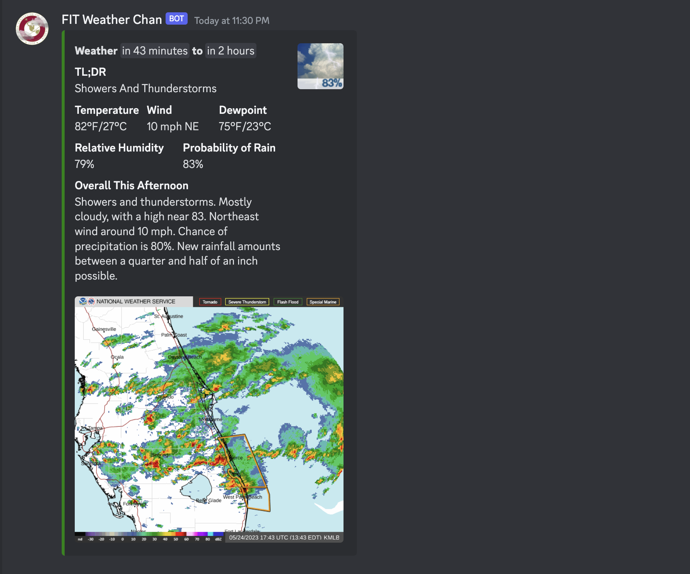

# FIT-Weather-Chan
Hourly weather updates for Florida Institute of Technology campus

  

## How do I add/use it?

1. [**Add the bot**](https://discord.com/api/oauth2/authorize?client_id=952765140468654100&permissions=536870912&scope=bot) to your FIT-related server. (its very light on permissions required)

2. Make a pull request appending your channel ID to the `discord_channels` array in [`others.json`](https://github.com/DaBigBlob/FIT-Weather-Chan/blob/main/others.json). Or [contact me on discord](https://discord.com/users/710693649662476359).

3. Done. Your FIT-related server channel should start receaving hourly weather updates as above.

## Why is the embed color so ugly?

## Where is the rest of the code?

### There are spelling mistakes in variable names
I dont care.

### There are improvements to be made
Please start making pull requests.

## Special thanks
- [NATIONAL WEATHER SERVICE](https://www.weather.gov/) for data.
- [WillowTheFuta#2396](https://discord.com/users/710302678323953676) for the avatar.